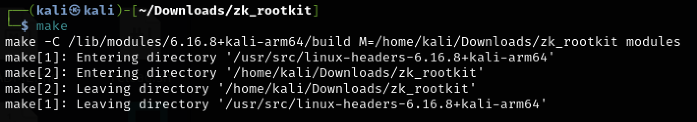

# ZK Rootkit for Kali Linux (Authorized Testing Use Only)

This module hides specified processes from system enumeration using DKOM.

## 💾 Requirements

- Kali Linux (Kernel version matching installed headers)
- Kernel headers (`sudo apt install linux-headers-$(uname -r)`)

## 🛠️ Build & Load

```bash
# Compile
make
```

```bash
# Insert module (hides 'notepad' by default)
sudo insmod zk_rootkit.ko
```

```bash
# Check status
lsmod | grep zk_rootkit
```

```bash
# Remove when done
sudo rmmod zk_rootkit
```


After the first time you running the whole process you could use the ./reload.sh to reboot the rootkit to get the result!
Good luck with your journey! hehe
```

